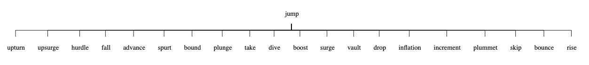
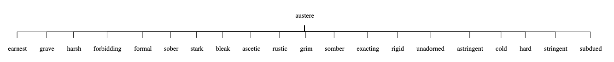
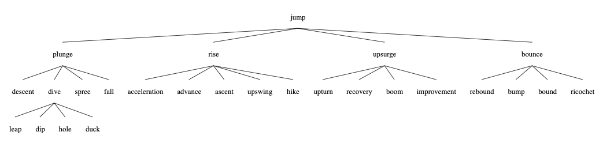
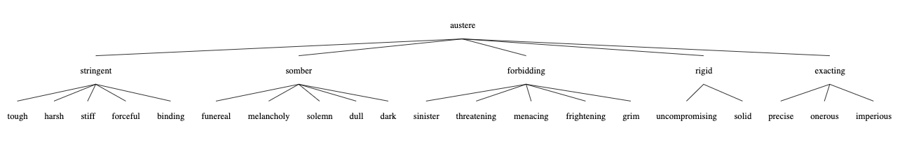
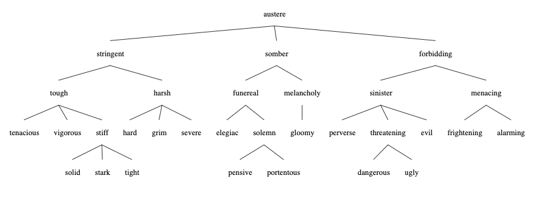
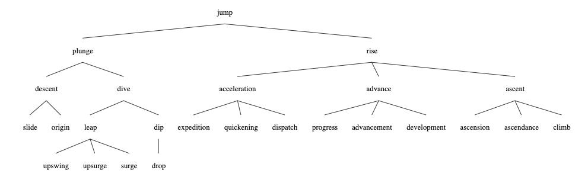
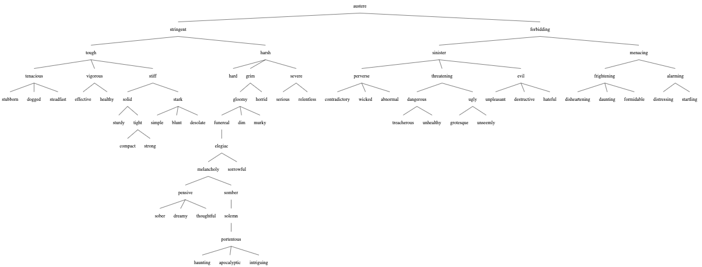
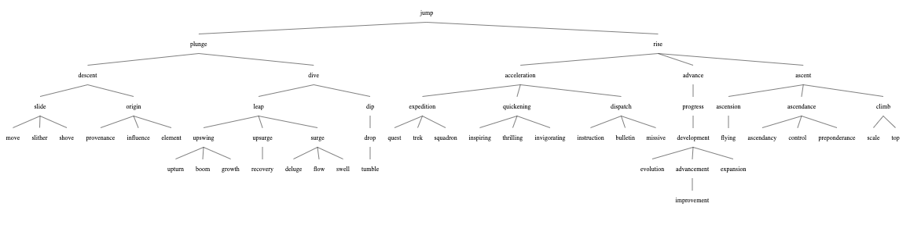

## project-Xplore

Experiment exploring connections within english words by creating deep chained synonym trees.

### Result

##### Depth = 1:



#
##### Depth = 2:



#
##### Depth = 3




#
##### Going into greater depths




### Running the app

```
git clone https://github.com/CodHeK/project-Xplore.git

// make sure you have go installed and PATH set once that is done just run

go run main.go

GO TO localhost:90/word/{you-word-here}

DEPTH can be set using the maxDepth variable in the main.go file
```

### In the end

Well, if you're wondering what is the use of doing this! I didn't find any except you can know synonyms of synonyms 
(don't know how that is useful, but ok! :stuck_out_tongue:) It was just a coding excercise I came up with to try out new things! 
######
So, please feel free to raise an issue if you find one! :smiley: